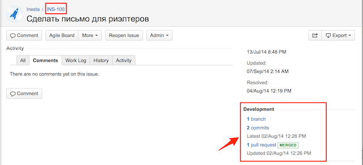

Работа с ветками
======================================

Создание ветки
------

Для каждой задачи в JIRA нужно делать отдельные ветки в репозитории.

Ветка и сообщение комита должны содержать номер задачи.
 
Пример правильного сообщения коммита - `JIRA-100: realtor email layout`
 
Пример неправильного сообщения - `hotfix bugs`.
 
Пример правильного названия ветки - `JIRA-100_realtor_emails`
 
Пример неправильного сообщения - `realtor_email`.

При правильном именовании JIRA связывает ветки с bitbucket.

Ветка создается из рабочей ветки `develop`.

Проверка функционала перед PR
------
Большое количество времени тратится, если задача была недостаточно оттестирована. 
Перед созданием PR нужно смержить ветку `develop` в рабочую ветку. 
После этого нужно протестировать базовый функционал, зайти пользователем в аккаунты, покликать по ссылкам в модуле, в котором были изменения.

Только после этого делаем PR.

Проверка функционала на тестовом сервере
------
Если в JIRA есть колонка STAGE, в нее задача должна перейти после проверки на сервере.

Смотри
[https://docs.google.com/document/d/1RN_yUGjxbgEIqC0K2qzqP7MFGwj8brNvZQKAoMK4f9I/edit#heading=h.c2k2tw45h159](https://docs.google.com/document/d/1RN_yUGjxbgEIqC0K2qzqP7MFGwj8brNvZQKAoMK4f9I/edit#heading=h.c2k2tw45h159)
